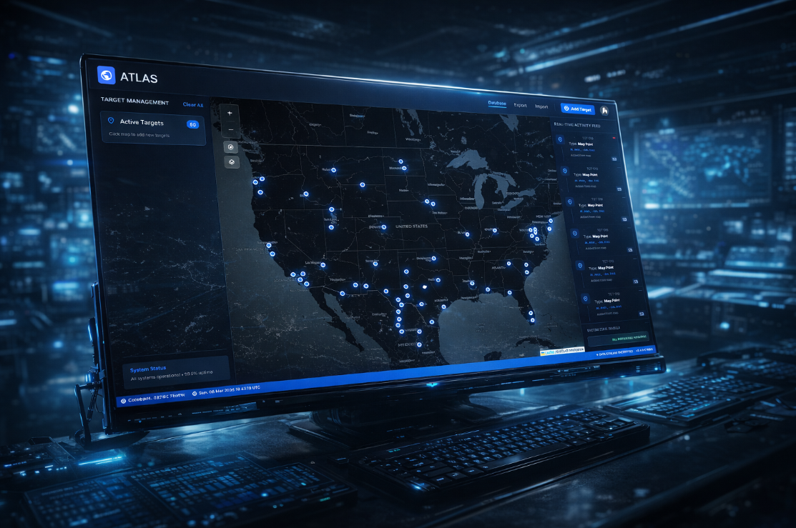

# ATLAS OSINT Operations Console

A professional tactical intelligence console for **GEO OSINT operations**, built with modern web technologies.  
ATLAS provides a geospatial intelligence environment for analysts to visualize, track, and manage open-source intelligence data in real time.

---

# 🚧 UNDER CONSTRUCTION

**Status:** Development in Progress  
**Completion:** ~85%  
**ETA:** Q2 2026  

ATLAS is currently under active development. Core architecture is complete and advanced OSINT features are being integrated.

---

# Current Implementation Status

## Completed Features

- Backend API Server — Express.js + TypeScript  
- Database Schema — Prisma ORM + SQLite  
- Frontend Framework — Next.js 14 + TypeScript  
- Tactical UI Components  
- OSINT Service Structure (IP Lookup / WHOIS / DNS)  
- WebSocket Infrastructure for real-time communication  
- Security Documentation and architecture

---

## In Development

- Map Integration (WebGL / Mapbox)
- Real-time data flow
- Authentication & user management
- Advanced OSINT data aggregation
- Performance optimization

---

## Known Issues

- WebGL browser compatibility
- Mapbox rendering adjustments
- WebSocket stability improvements
- Production environment configuration

---

# Architecture Overview

ATLAS follows a modular intelligence platform architecture.

### Backend

- Node.js
- Express
- TypeScript
- Prisma ORM
- SQLite
- Socket.io WebSocket server

### Frontend

- Next.js 14
- React 18
- TypeScript
- TailwindCSS
- Zustand state management
- Mapbox GL JS (in progress)
- Socket.io client

---

# What Has Been Built

## Architecture

- Modular microservices-style backend
- Full TypeScript type safety
- Optimized database schema for OSINT data
- Security-focused backend structure
- RESTful API endpoints

---

## User Interface

- Tactical cyber-style dark theme
- Responsive dashboard layout
- Modular React component system
- Global state management (Zustand)
- TailwindCSS based design system

---

# Future Roadmap

## Phase 1 — Core Platform

- UI framework
- Backend API
- Database schema
- Map integration
- Real-time data flow

---

## Phase 2 — Intelligence Tools

- Authentication system
- Advanced OSINT modules
- Data visualization
- Performance optimization

---

## Phase 3 — Production Release

- Security hardening
- Load testing
- Documentation
- Deployment infrastructure

---

# Tech Stack

## Frontend

- Next.js 14
- React 18
- TypeScript
- TailwindCSS
- Mapbox GL JS
- Zustand
- Socket.io Client

---

## Backend

- Node.js
- Express
- TypeScript
- Prisma ORM
- SQLite
- Socket.io

---

# Installation (Development)

### Requirements

- Node.js 18+
- npm or yarn

---

### Clone Repository

```bash
git clone https://github.com/yagizaladag/ATLAS-IntelHub.git
cd ATLAS-IntelHub
